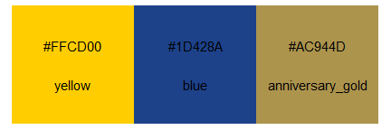
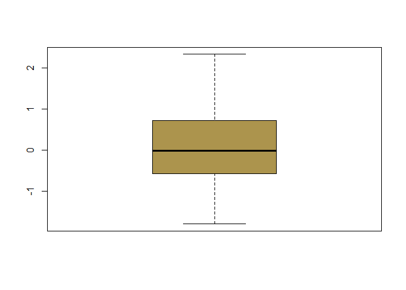

<!-- README.md is generated from README.Rmd. Please edit that file -->

leeds
=====

<!-- badges: start -->
<!-- badges: end -->

The goal of leeds is to generate plots in one of three colours (Leeds
blue, Leeds yellow or Leeds anniversary gold) specified by the user.



Installation
------------

You can install from [GitHub](https://github.com/) with:

``` r
# install.packages("devtools")
devtools::install_github("3mmaRand/leeds")
```

Example
-------

This is a basic example:

``` r
library(leeds)
seed <- 4
leeds_box("anniversary_gold", seed)
```


